# 🍷 Red Wine Quality MLOps Project

This project is a comprehensive example of a **Production-Ready MLOps Pipeline**. It goes beyond simple model training by incorporating data versioning, experiment tracking, automated validation, and continuous integration/deployment.

---

## 🗺 Project Workflow Flowchart

```mermaid
graph TD
    A["🌐 Remote Data Source (GitHub/S3)"] -->|src/load_data.py| B["📁 data/raw/"]
    B -->|src/split_data.py| C["📁 data/processed/ (Train/Test)"]
    C -->|src/train.py| D["🧠 Model Training"]
    D -->|Logs| E["📊 MLflow Tracking"]
    D -->|Saves| F["💾 models/model.joblib"]
    C -->|src/evaluate.py| G["📈 Evaluation (Metrics)"]
    G -->|Reports| H["📄 reports/metrics.json"]
    F -->|Inference| I["🚀 FastAPI (app.py)"]
    I -->|Predict| J["🧑‍💻 End User"]
    
    subgraph "DVC Pipeline (dvc repro)"
    B
    C
    D
    G
    end
    
    subgraph "CI/CD (GitHub Actions)"
    K["Commit & Push"] --> L["Run DVC Pipeline"]
    L --> M["Validate Model"]
    M --> N["Deploy API"]
    end
```



---

## ✨ Key Features

-   **Data Versioning with DVC**: Track changes in your dataset just like code.
-   **Experiment Tracking with MLflow**: Log every parameter, metric, and model artifact.
-   **Automated Pipeline**: Structured stages (`load` -> `split` -> `train` -> `evaluate`) ensuring reproducibility.
-   **Rest API Serving**: A robust FastAPI application to serve predictions in real-time.
-   **CI/CD & CT**: GitHub Actions pipeline for Continuous Integration, Deployment, and Testing.
-   **Flexible Input**: The API handles both space-separated and underscore-separated JSON keys for convenience.

---

## 📂 Project File Breakdown

### 🏗 Core Infrastructure
-   `dvc.yaml`: The "brain" of the pipeline. Defines the sequence of execution and dependencies between stages.
-   `params.yaml`: The single source of truth for all configurations (URLs, file paths, hyperparameters).
-   `requirements.txt`: Python dependencies required for the project.

### 📜 Source Code (`src/`)
-   `load_data.py`: Fetches the raw dataset from a remote source (GitHub/S3) and saves it locally.
-   `split_data.py`: Prepares the data for ML by splitting it into training and testing sets.
-   `train.py`: The core ML logic. It reads parameters from `params.yaml`, trains an ElasticNet model, and logs everything to MLflow.
-   `evaluate.py`: Calculates metrics (RMSE, MAE, R2) on the test set and saves them for comparison.
-   `app.py`: A FastAPI web server that loads the best-trained model and exposes a `/predict` endpoint.

### ⚙ Automation & Tracking
-   `.github/workflows/pipeline.yaml`: Automates the entire workflow on every `git push`.
-   `mlruns/` & `mlflow.db`: Local storage for MLflow experiments and metadata.
-   `.dvc/`: Internal DVC metadata for tracking large data files.

---

## 🧠 Why is this MLOps?

This project isn't just a "notebook script." It follows the core pillars of MLOps:
1.  **Reproducibility**: Anyone can run `dvc repro` and get the *exact* same result.
2.  **Transparency**: MLflow records who trained what, with what data, and what the results were.
3.  **Automation**: Code changes trigger automated tests and deployments via GitHub Actions.
4.  **Operationalization**: The model is instantly available as a web service via FastAPI.
5.  **Continuous Testing (CT)**: The pipeline evaluates the model performance automatically, acting as a gatekeeper for quality.

---

## 📊 MLflow Guide

### 1. Creating Different Experiments
By default, MLflow logs to "Default". To create a new experiment:
```python
mlflow.set_experiment("My_New_Experiment")
```
Modify `src/train.py` to add this line before `mlflow.start_run()`.

### 2. Training with Different Hyperparameters
Don't change the code! Simply modify `params.yaml`:
```yaml
estimators:
  ElasticNet:
    params:
      alpha: 0.5  # Change this
      l1_ratio: 0.5 # Change this
```
Then run `dvc repro` or `python src/train.py`.

### 3. Comparing Models
Run the UI:
```bash
mlflow ui
```
Open `http://127.0.0.1:5000`. You can select multiple runs and click **Compare** to see charts and metric differences.

---

## 🚀 CI/CD & GitHub Integration

### 1. How to put it on GitHub
1. Create a repository on GitHub.
2. Run these commands:
```bash
git init
git add .
git commit -m "Initial MLOps Setup"
git remote add origin <your-repo-url>
git push -u origin main
```

### 2. Running GitHub Actions
Every time you `git push`, the `.github/workflows/pipeline.yaml` is triggered. It:
- Sets up the environment.
- Runs the DVC pipeline.
- Ensures the code and model are valid.

### 3. CI/CD & CT Pipeline
-   **CI (Continuous Integration)**: Checks for code syntax and basic functionality.
-   **CD (Continuous Deployment)**: In a real-world scenario, this would deploy your FastAPI app to a cloud platform (like Heroku or AWS).
-   **CT (Continuous Testing)**: The `evaluate` stage checks if the model performance meets expectations before "moving to production."

---

## 🛠 How to Use

### Setup
```bash
python -m venv venv
./venv/Scripts/activate  # On Windows
pip install -r requirements.txt
```

### Reproduce Everything
```bash
dvc repro
```

### Predict
Start the server:
```bash
uvicorn src.app:app --reload
```
Test with a POST request (Supports both `fixed_acidity` and `fixed acidity`):
```bash
curl -X 'POST' \
  'http://127.0.0.1:8000/predict' \
  -H 'Content-Type: application/json' \
  -d '{
  "fixed acidity": 7.4,
  "volatile acidity": 0.7,
  "citric acid": 0.0,
  "residual sugar": 1.9,
  "chlorides": 0.076,
  "free sulfur dioxide": 11.0,
  "total sulfur dioxide": 34.0,
  "density": 0.9978,
  "pH": 3.51,
  "sulphates": 0.56,
  "alcohol": 9.4
}'
```
